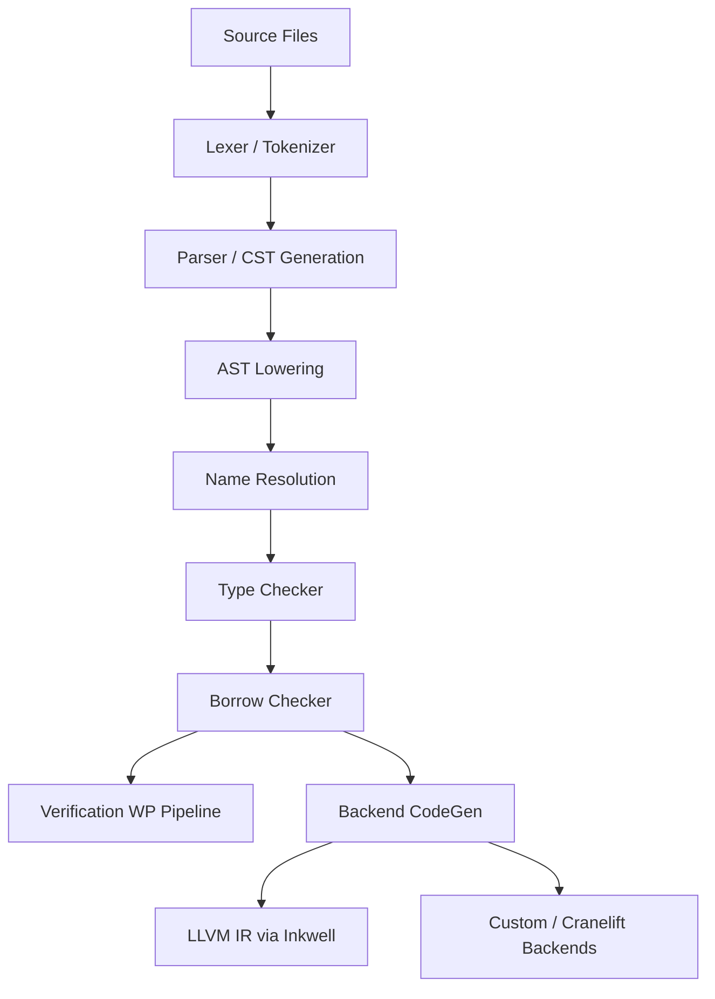

# Vera Compiler Architecture

This document provides a high-level overview of the pipeline for the Vera compiler. The compiler is designed to be highly modular, supporting incremental compilation, excellent Language Server Protocol (LSP) integration, and a verification-first approach to code generation.

## High-Level Pipeline

The compiler transforms source code into executable binaries through a series of distinct, isolated stages. To support incremental compilation from scratch, each stage acts as a functional query that takes input from the previous stage and memoizes its output.

## Compiler Stages

### 1. Lexing
The lexer converts raw UTF-8 text into a stream of tokens. It records the exact source span (file ID, start byte, end byte) for every token, which is critical for mapping errors back to the source code later.

### 2. Parsing (Lossless CST)
Instead of producing a rigid Abstract Syntax Tree (AST) that fails on invalid code, the parser produces a **Concrete Syntax Tree (CST)**. The CST retains all whitespace, comments, and invalid syntax nodes. This allows the compiler to provide continuous LSP support (autocomplete, formatting) even when the user is in the middle of typing an incomplete statement.

### 3. Name Resolution & Module System
This stage resolves all `import` paths and builds a directed acyclic graph (DAG) of module dependencies. It enforces visibility (`pub` vs private) rules.

### 4. Semantic Analysis & Type Checking
The compiler traverses the validated syntax tree to infer types, resolve trait bounds, and verify type safety. The output of this stage is a strongly typed High-Level Intermediate Representation (HIR).

### 5. Borrow Checking
Operating on the HIR, the borrow checker verifies memory safety by analyzing the lifetimes of `ref` and `mut ref` types, ensuring there are no mutable aliasing violations.

### 6. Verification Pipeline
The verification stage works alongside the code generation stage. It takes the HIR, generates Weakest Precondition (WP) verification conditions, and dispatches them to an SMT solver (e.g., Z3). A program is only considered valid if the SMT solver can prove all assertions.

### 7. Backend Generation
The backend is designed to be abstract, defined by a Rust `trait` interface. This allows the compiler to support multiple backends.
* **LLVM Backend (Primary)**: Uses the `inkwell` crate to emit optimized LLVM IR, leveraging LLVM's massive suite of optimization passes (`O1`, `O2`, `O3`) and broad target architecture support.
* **Alternative Backends**: The abstract trait interface ensures that in the future, we can plug in other backends like Cranelift for faster debug builds, or even a manual assembly backend for niche architectures.
