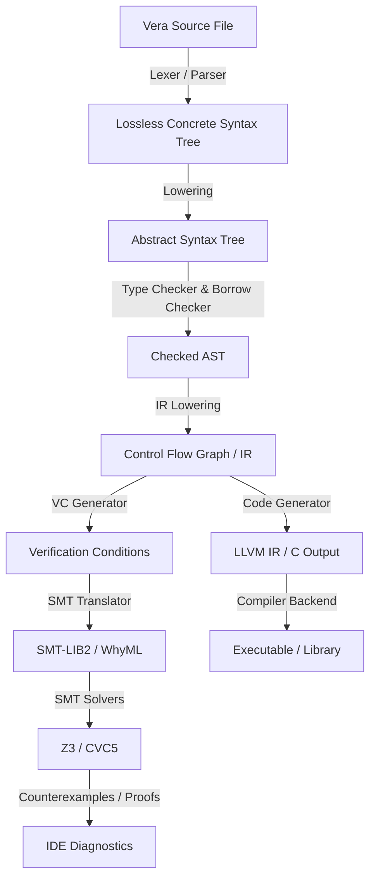

# Vera Compiler and LSP Architecture

To make Vera a practical, productive language, the compiler and Language Server Protocol (LSP) are co-designed. The compiler must compile verified code to efficient machine binaries, while the LSP must provide sub-millisecond, IDE-grade developer feedback (syntax highlighting, diagnostics, auto-complete, jump-to-definition, and SMT verification feedback).

---

## 1. Compiler Pipeline Overview



---

## 2. Lossless Parser and AST Representation

Traditional compilers throw away whitespace, comments, and invalid syntax during lexing. For an LSP, this is unacceptable because:
- **Refactoring** (renaming, formatting) requires reconstructing the exact source layout.
- **Error Recovery** is needed when the user is mid-typing (e.g., `let x = ` should still parse and typecheck everything else around it).

### Lossless Concrete Syntax Tree (CST)
We will use a CST library (like Rust's `rowan`) to represent the syntax. Every token (including comments and whitespaces) is a node in the syntax tree:
- Parse errors are represented as special `Error` nodes instead of halting the parser.
- Navigating the syntax tree is done using offset ranges.

### AST Lowering
A separate pass lowers the concrete syntax tree into a strongly typed **Abstract Syntax Tree (AST)** used by the typechecker and verification engine.

### Self-Hosting Optimization: "Strip Mode"
Rowan CSTs are highly memory-intensive because they retain every comment, whitespace, and formatting token. While essential for LSP diagnostics and refactoring, this memory overhead can severely impact compilation performance during CLI builds and self-hosting.

To optimize performance, the compiler's parsing crate supports a compile-time **Strip Mode**:
* **Discarding CST Metadata**: When building the compiler for CLI execution, the lexer discards whitespace and comment tokens.
* **Direct AST Parsing**: The parser builds a simplified AST directly, bypassing Rowan CST construction.
* **Performance Gain**: This reduces compilation memory usage by up to 80% and significantly increases parser throughput, making self-hosting on standard platform resource limits practical.

---

## 3. Incremental Query Engine (`salsa`)

Verification can be slow, as SMT solvers may take seconds to prove complex contracts. To prevent the IDE from freezing, the compiler and LSP will use an **Incremental Query Engine** (such as Rust's `salsa`).

- The compiler divides its passes into discrete "queries" (e.g., `parse_file`, `typecheck_fn`, `verify_fn`).
- Salsa tracks the dependencies of each query. If the user edits function `B`, queries that only depend on function `A` are cached and not re-evaluated.
- Verification is performed in the background, only re-running SMT solver calls for modified functions and their transitive dependencies.

---

## 4. Verification Condition (VC) Generator

The verification backend operates on the Control Flow Graph (CFG) of the intermediate representation.

```
                  [Entry Precondition]
                           │
                           ▼
                    [Basic Block 1]
                           │
                           ▼
                ┌──────────────────┐
                │                  │
                ▼                  ▼
          [True Branch]      [False Branch]
                │                  │
                └────────┬─────────┘
                         │
                         ▼
                [Loop Invariant Check]
                         │
                         ▼
                    [Exit Block]
                         │
                         ▼
                 [Postcondition]
```

### Weakest Precondition (WP) Calculus
The VC generator translates the CFG into verification conditions by propagating properties backward:
- **Assignment `x = e`**: The WP of a postcondition $P(x)$ is $P(e)$ (substituting $e$ for $x$).
- **Assertions**: `assert Q` creates a verification condition $Q \land (Q \implies P)$.
- **Loop Invariants**: The loop is split into three proof obligations:
  1. **Initiation**: The invariant holds when entering the loop.
  2. **Preservation**: The invariant is preserved by a single arbitrary iteration of the loop body.
  3. **Use**: The invariant plus the negation of the loop condition implies the post-loop properties.

### Translation to WhyML
To avoid writing solver-specific encodings from scratch, the VC generator can target **WhyML** (the language of the Why3 platform). Why3 provides:
- Translations of loop invariants, memory models, and heap allocations.
- A standardized driver layer that invokes multiple SMT solvers (Z3, CVC5, Alt-Ergo) and parses their output.

---

## 5. LSP Features for Verification

A verification-driven LSP offers unique developer tools:

1. **Inline Proof Status**:
   - Small icons (green checkmarks or red warnings) next to functions, assertions, and loop invariants.
   - Hovering over a checkmark displays the solver name and time taken (e.g., `Z3: verified in 42ms`).

2. **Visual Counterexample Debugging**:
   - If an assertion fails, the SMT solver returns a counterexample model (values of variables that trigger the failure).
   - **Local Scope Filtering**: To prevent cluttering the editor with hundreds of internal SMT solver variables, the LSP filters the model to only extract variables defined in the function's local scope that are directly referenced in the failing assertion or postcondition.
   - **Collapsible Inlay Hints**: The filtered counterexample values are overlaid inline as collapsible virtual inlay hints (inline virtual text) that do not offset actual code lines and can be toggled on/off with an editor shortcut.

3. **Incremental Asynchronous Proofs**:
   - Background verification runs asynchronously on separate threads. Z3/CVC5 are invoked with a hard timeout limit (defaulting to 1 second).
   - If a proof times out, the LSP overlays an inconclusive warning diagnostics marker (`Verification timed out (inconclusive)`) rather than blocking the editor or lagging user typing feedback.

4. **Precondition Vacuity Diagnostics**:
   - In the background, the LSP server automatically dispatches a vacuity query (`exists(args) { Precondition(args) }`) for all edited functions.
   - If the SMT solver returns `unsat` (unsatisfiable), the LSP overlays a diagnostic warning directly on the function signature in the editor (e.g., `Warning: Precondition is unsatisfiable; all postconditions will be vacuously proven!`).
   - This provides immediate feedback to developers, catching bugs (such as incorrect constant initializations or impossible constraints) that would otherwise lead to silent verification vacuities.

---

## 6. Project Crate Structure (Rust implementation)

We will structure the compiler codebase into the following crates:

```text
verify/
├── Cargo.toml
├── src/
│   └── main.rs             # CLI driver for the compiler
└── crates/
    ├── vera_syntax/        # Lexer, Lossless Parser (rowan)
    ├── vera_ast/           # Abstract Syntax Tree representation
    ├── vera_checker/       # Type-checker and Borrow-checker
    ├── vera_vcgen/         # CFG constructor, WP calculus, Why3/SMT translation
    ├── vera_codegen/       # C / LLVM IR generation
    └── vera_lsp/           # LSP Server implementation
```
